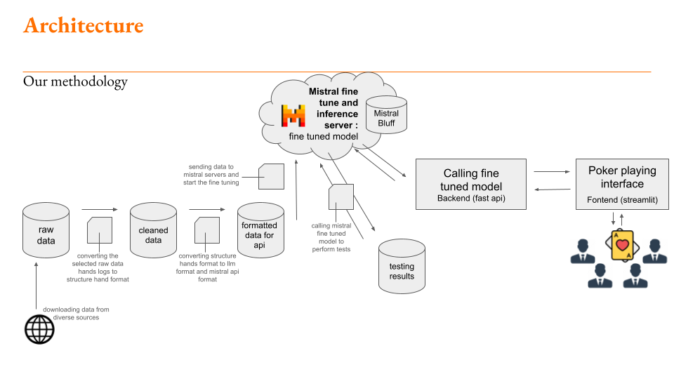

# MistralBluff: A Poker Bot using Mistral LLM


Welcome to the MistralBluff project! This project was developed as part of the Mistral AI Fine Tune Hackathon, where we fine-tuned a Mistral non-instruct 7B model to create an intelligent poker bot. This README provides an overview of the project's structure, data, backend, frontend, notebooks, and pipelines, along with installation and usage instructions.

The project consists of a pipeline of transforming raw log poker hands data into a format suitable for fine-tuning the Mistral model. The fine-tuned model is then used to create a poker bot that can make intelligent decisions during gameplay. The backend server serves as the interface between the frontend and the Mistral model, allowing users to interact with the poker bot through a user-friendly interface. The model is also tested using specific metrics like ranges to evaluate its performance and compare it to other poker pro.

## Table of Contents

1. [Installation](#installation)
2. [Project Structure](#project-structure)
3. [Data](#data)
4. [Backend](#backend)
5. [Frontend](#frontend)
6. [Notebooks](#notebooks)
7. [Pipelines](#pipelines)

## Installation

First, ensure you have the necessary dependencies installed:

```bash
pip install -r requirements.txt
```

Create a .env file at the root with these variables:
MISTRAL_API_KEY=<your_mistral_api_key>
MISTRAL_JOB_ID=<finetuned_model_id>
URL_BACKEND=<url_of_the_backend>

## Project Structure

The project is organized into the following directories:

- `backend/`: Contains the backend server code.
- `frontend/`: Contains the frontend interface code.
- `data/`: Contains the differents stages of data from raw to data prepared for fine tuning along with some results.
- `notebooks/`: Contains Jupyter notebooks for data exploration, model training and testing.
- `pipelines/`: Contains custom pipelines designed for this project.



## Data

We aggregated poker hand data from various sources and formatted it into a standard format suitable for training the Mistral model. The data processing involves several steps, including:

1. **Data Aggregation**: Collecting raw poker hand data from different sources. Raw data can be found in the `data/raw_data/` directory.
2. **Data Formatting and Cleaning**: Cleaning and standardizing the raw data into a common format and putting them in llm format. We chose only one source in the end after some explorations. The cleanded data can be found in the `data/data_cleaned/` directory.
3. **Data Preparation for LLM**: Converting the standardized data into a format suitable for the LLM and mistral api. The data prepared for fine tuning can be found in the `data/data_prepared_for_fine_tuning/` directory.
4. **Results**: The results of the fine-tuning process can be found in the `data/results/` directory.

All these data by step are in the `data/` directory.

## Fine-tuning

The fine-tuning process is implemented in the `notebooks/finetuning/finetune_api.ipynb` notebook. This notebook provides a step-by-step guide to fine-tuning the Mistral model using the Mistral API.

## Backend

The backend is built using FastAPI and serves as the interface between the frontend and the Mistral model. To run the backend server, follow these steps:

```bash
source venv/Scripts/activate
cd backend
uvicorn main:app --reload
```

This will start the backend server on `http://127.0.0.1:8000`.

## Frontend

The frontend is built using Streamlit, providing a user-friendly interface to interact with the poker bot. To run the frontend interface, follow these steps:

```bash
source venv/Scripts/activate
streamlit run frontend/poker_interface.py
```

This will start the Streamlit application, which can be accessed in your web browser.

## Notebooks

The `notebooks/` directory contains Jupyter notebooks used for data exploration, analysis, and model training. These notebooks provide insights into the data and the training process of the Mistral model.

## Pipelines

The `pipelines/` directory contains custom data processing pipelines functions designed for this project. These pipelines automate the data preparation, ensuring a smooth workflow from raw data to training and testing data.

## Conclusion

MistralBluff is a comprehensive project combining data science, machine learning, and software development to create an intelligent poker bot. We hope you find this project insightful and useful. For any questions or contributions, feel free to reach out or submit a pull request.

Enjoy bluffing with MistralBluff!

## Contributors
- Soel Megdoud [github](https://github.com/SoelMgd)
- Anatole Vakili [github](https://github.com/SoAnVa)
- Julien Delavande [github](https://github.com/JulienDelavande)
